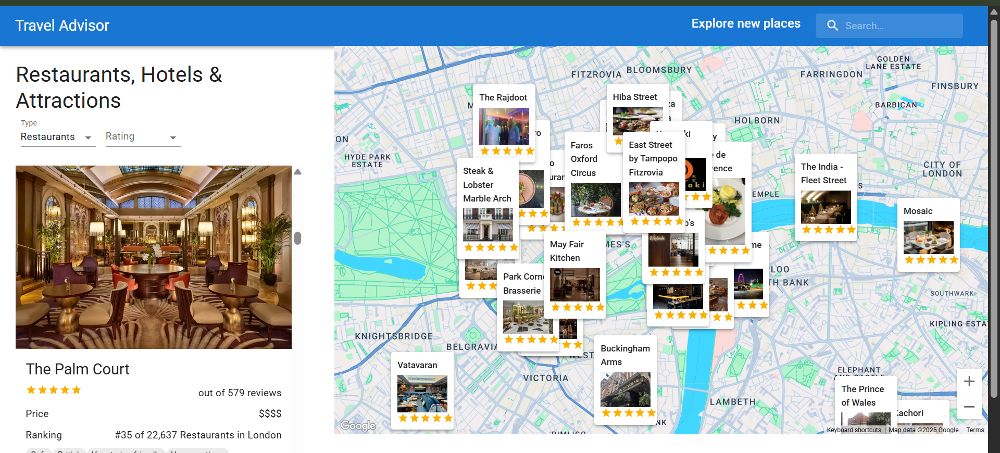

# Travel Advisor

A React web app that helps users discover restaurants, hotels, and attractions on an interactive map.

[**Live Demo on Netlify →**](https://YOUR_NETLIFY_URL)  




## Features
- Google Maps integration
- Real‑time weather data
- Filtering by type & rating
- Responsive design

## Tech Stack
- React + (Material UI )
- Google Maps JavaScript API
- OpenWeather API (or the one you use)

## Getting Started
```bash
npm install

npm start    

