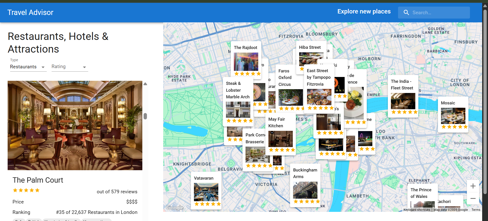

# Travel Advisor

A React web application for discovering restaurants, hotels, and attractions using an interactive map.



## Features

- Interactive Google Maps integration
- Weather information
- Filtering by place type and rating
- Responsive user interface

## Tech Stack

- React
- Material UI
- Google Maps JavaScript API
- Weather API integration

## Getting Started

Install dependencies:

```bash
npm install
```

Start the application:

```bash
npm start
```

## Purpose

This project demonstrates frontend API integration, map-based interfaces, filtering, and responsive React development.
